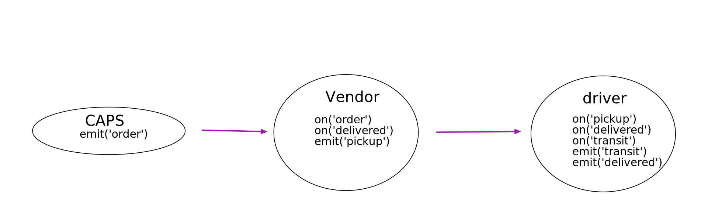

# caps
A real-time service that allows for vendors, such as flower shops or restaurants, to alert a system of a package needing to be delivered, for drivers to instantly see what’s in their pickup queue, and then to alert the vendors as to the state of the deliveries (in transit, and then delivered).

## Links and Resources

## Setup
`npm i jest eslint dotenv faker`

## How to initialize/run your application (where applicable)
- node .

## How do you run test?
- npm test
- npm run lint 

## UML
